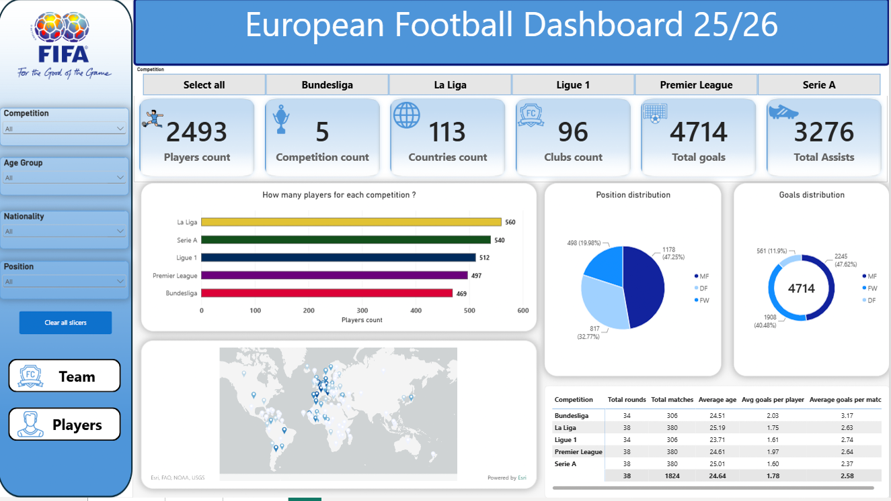
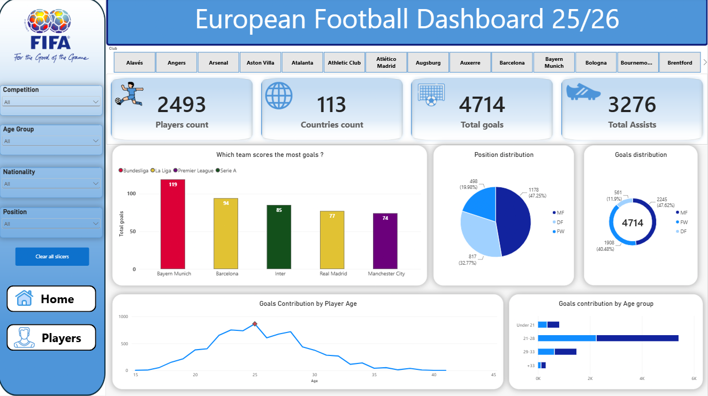
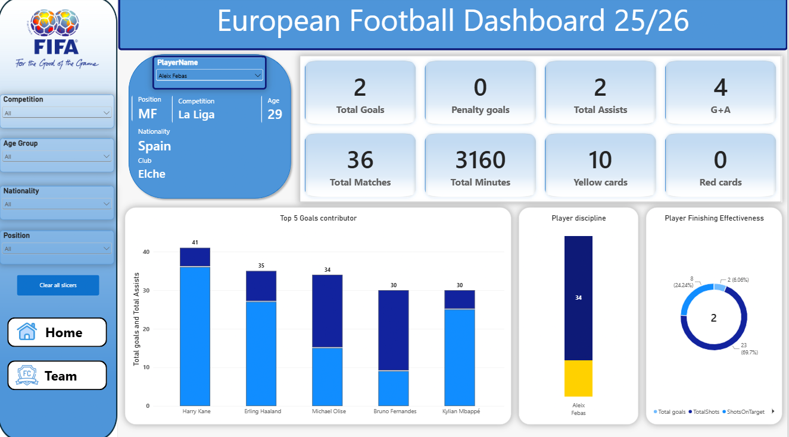
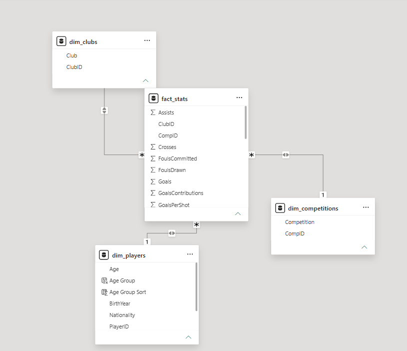

# ⚽ European Football Dashboard 25/26

An interactive **Power BI football analytics dashboard** analyzing player and team performance across Europe's top five domestic leagues during the **2025/26 season**.

The project transforms football player statistics into an interactive analytical report that allows users to explore **player performance, team scoring, competition statistics, player demographics, positions, nationalities, and age groups**.

---

## 📌 Project Overview

The **European Football Dashboard 25/26** was built to analyze football performance across five major European competitions:

* 🇩🇪 Bundesliga
* 🇪🇸 La Liga
* 🇫🇷 Ligue 1
* 🏴 Premier League
* 🇮🇹 Serie A

The dashboard provides two main analytical perspectives:

1. **Competition & Team Analysis**
2. **Individual Player Analysis**

Users can interact with the dashboard using slicers, competition filters, club selections, player selections, nationality, position, and age groups.

---

## 🎯 Project Objectives

The main objectives of this project were to:

* Analyze football player performance across Europe's top five leagues.
* Compare competitions based on players, clubs, goals, assists, and other metrics.
* Analyze team goal-scoring performance.
* Examine player performance by position.
* Analyze the relationship between player age and goal contribution.
* Compare player finishing effectiveness.
* Analyze player discipline through yellow and red cards.
* Build an interactive Power BI dashboard for football performance analysis.
* Apply data modeling and DAX to create a reusable analytical model.

---

# 📊 Dashboard Structure

The report contains three main pages:

### 1. Overview

The Overview page provides a high-level summary of the five competitions.

Key KPIs include:

* Players Count
* Competition Count
* Countries Count
* Clubs Count
* Total Goals
* Total Assists

### Visualizations

#### Players by Competition

A comparison of the number of players participating in each competition.

#### Position Distribution

Shows the distribution of players across:

* MF — Midfielders
* DF — Defenders
* FW — Forwards

#### Goals Distribution by Position

Shows how goals are distributed across different player positions.

#### Nationality Map

An interactive map showing the geographical distribution of player nationalities.

#### Competition Summary Table

Provides competition-level metrics including:

* Total Rounds
* Total Matches
* Average Age
* Average Goals per Player
* Average Goals per Match

This allows users to compare the five competitions from multiple perspectives.

---

# 🏆 Team Analysis

The Team page focuses on club-level performance.

Users can select clubs and analyze their performance across the dataset.

### Main KPIs

* Players Count
* Countries Count
* Total Goals
* Total Assists

### Team Visualizations

#### Team Goals Comparison

Compares the goal-scoring performance of selected clubs across competitions.

#### Position Distribution

Shows the composition of the selected team's players by position.

#### Goals Distribution

Breaks down team goals by player position.

#### Goals Contribution by Player Age

A line chart showing how goal contributions are distributed across different player ages.

#### Goals Contribution by Age Group

Compares total goals and assists across defined age groups.

---

# 👤 Player Analysis

The Players page provides a detailed profile for an individual football player.

Users can select a player and view their:

* Position
* Competition
* Age
* Nationality
* Club

### Player KPIs

The dashboard displays:

* Total Goals
* Penalty Goals
* Total Assists
* Goals + Assists
* Total Matches
* Total Minutes
* Yellow Cards
* Red Cards

This provides a compact overview of the selected player's season performance.

### Player Visualizations

#### Top 5 Goals Contributors

Compares the selected player's goal contribution with the top players in the dataset.

#### Player Discipline

Analyzes the selected player's:

* Total Goals
* Shots
* Shots on Target

alongside their disciplinary statistics.

#### Player Finishing Effectiveness

Visualizes the relationship between:

* Goals
* Shots
* Shots on Target

to provide a view of the player's finishing performance.

---

# 🧩 Data Model

The project uses a **star-schema-style data model** consisting of dimension tables surrounding a central fact table.

```text
                 dim_clubs
                     │
                     │
                     ▼
dim_players ───── fact_stats ───── dim_competitions
```

### Dimension Tables

#### `dim_players`

Contains player-level descriptive information:

* PlayerID
* PlayerName
* Nationality
* Position
* Age
* BirthYear
* Age Group
* Age Group Sort

#### `dim_clubs`

Contains club information:

* ClubID
* Club

#### `dim_competitions`

Contains competition information:

* CompID
* Competition

### Fact Table

#### `fact_stats`

Contains player performance statistics and foreign keys connecting the fact table to the dimensions.

Key statistics include:

* Matches Played
* Matches Started
* Minutes Played
* Goals
* Assists
* Goals Contributions
* Non-Penalty Goals
* Penalty Goals
* Penalty Attempts
* Yellow Cards
* Red Cards
* Shots
* Shots on Target
* Shots on Target %
* Shots per 90
* Shots on Target per 90
* Goals per Shot
* Goals per Shot on Target
* Crosses
* Tackles Won
* Interceptions
* Fouls Drawn
* Fouls Committed
* Own Goals

The model uses relationships between the dimension tables and `fact_stats` to allow filters and slicers to propagate through the report.

---

# 📐 Age Group Segmentation

To analyze player performance by age, I created an **Age Group** calculated column in `dim_players`.

Players are classified into four groups:

| Age Group | Age Range |
| --------- | --------: |
| Under 21  |      < 21 |
| 21–28     |     21–28 |
| 29–33     |     29–33 |
| +33       |       34+ |

An **Age Group Sort** column was also created to ensure that the groups appear in the correct analytical order rather than alphabetical order.

This segmentation is used in visuals such as:

* Goals Contribution by Age Group
* Team analysis
* Player filtering
* Comparative performance analysis

---

# 🧮 DAX & Measures

A dedicated **`_measures` table** was created to organize all DAX measures in one place.

This keeps the model cleaner and makes the measures easier to maintain and locate.

The measures are used throughout the dashboard for:

* Total Goals
* Total Assists
* Goals + Assists
* Total Matches
* Total Minutes
* Players Count
* Clubs Count
* Countries Count
* Competition Count
* Average Age
* Average Goals
* Goals Contribution
* Player Performance
* Competition Performance
* Team Performance

The use of dedicated measures allows the visuals to respond dynamically to:

* Player selection
* Club selection
* Competition selection
* Position selection
* Nationality selection
* Age Group selection

---

# 🎛️ Interactive Features

The dashboard includes multiple interactive controls.

### Slicers

Users can filter the analysis by:

* Competition
* Age Group
* Nationality
* Position
* Player

### Navigation

The report contains navigation between:

* 🏠 Overview
* 🏆 Team
* 👤 Players

This allows users to move between high-level competition analysis and detailed team/player analysis.

---

# 📈 Key Analytical Areas

The dashboard focuses on several football analytics dimensions.

### Player Performance

* Goals
* Assists
* Goal Contributions
* Matches
* Minutes
* Shots
* Shots on Target
* Finishing effectiveness

### Team Performance

* Total Goals
* Total Assists
* Player Composition
* Position Distribution
* Age-based Goal Contribution

### Competition Analysis

* Number of Players
* Number of Clubs
* Number of Countries
* Total Goals
* Total Assists
* Matches
* Average Age
* Average Goals per Player
* Average Goals per Match

### Player Demographics

* Age
* Age Group
* Nationality
* Position
* Competition
* Club

### Discipline

* Yellow Cards
* Red Cards

---

# 🛠️ Tools & Technologies

* **Microsoft Power BI**
* **DAX**
* **Data Modeling**
* **Star Schema**
* **Power BI Relationships**
* **Data Visualization**
* **Interactive Dashboards**
* **Football Analytics**

---

# 🧠 Skills Demonstrated

This project demonstrates practical experience with:

### Power BI

* Dashboard development
* Interactive reports
* Slicers
* Page navigation
* Drill-through concepts
* KPI cards
* Tables and matrices
* Charts
* Maps
* Conditional visual interactions

### Data Modeling

* Fact and dimension tables
* Star-schema modeling
* Primary/foreign-key relationships
* One-to-many relationships
* Model organization
* Dedicated measure table

### DAX

* Measures
* Calculated columns
* Aggregations
* Filter context
* Comparative analysis
* Dynamic KPIs
* Segmentation
* Ranking calculations

### Data Analytics

* Player performance analysis
* Team analysis
* Competition comparison
* Age segmentation
* Position analysis
* Nationality analysis
* Goal contribution analysis
* Performance comparison

---

# 💡 Business Questions / Football Questions

The dashboard was designed to answer questions such as:

* How many players are represented in each competition?
* Which competitions contain the most players?
* How are players distributed by position?
* How are goals distributed across positions?
* Which clubs score the most goals?
* How does goal contribution vary by player age?
* How does performance differ between age groups?
* What is the selected player's overall contribution?
* How effective is a player's finishing?
* How many shots and shots on target does a player produce?
* How does a player's performance compare with other players?
* How does player nationality distribution vary across the dataset?
* How do competitions compare in terms of goals and assists?

---

# 📷 Dashboard Preview

## Overview



## Team Analysis



## Player Analysis



## Data Model



---
---

# 📌 Project Highlights

### Data Modeling

Designed a structured analytical model using separate player, club, and competition dimensions connected to a central statistics fact table.

### Measure Management

Created a dedicated `_measures` table to centralize DAX measures and keep the Power BI model organized.

### Player Segmentation

Created age groups:

* Under 21
* 21–28
* 29–33
* +33

and implemented an Age Group Sort column to maintain the correct analytical order.

### Interactive Analysis

Built interconnected report pages where users can filter and explore the data from competition, team, and individual-player perspectives.

### Football Analytics

Combined player statistics, team performance, demographics, age segmentation, position analysis, and discipline metrics into one interactive analytical solution.

---

# 🚀 Conclusion

The **European Football Dashboard 25/26** demonstrates how Power BI can transform detailed football statistics into an interactive analytical product.

The project combines **data modeling, DAX, interactive visualization, segmentation, KPI development, and football analytics** to provide multiple levels of analysis—from European competition comparisons to individual player performance.

The main focus was not only on creating visually appealing dashboards, but also on building a **structured Power BI data model that supports reusable measures, meaningful relationships, dynamic filtering, and scalable analysis**.

---

## 👨‍💻 Author

**Osama**

Data Analyst | SQL | Power BI | Excel | Python | Data Analytics

---

## ⭐ Skills & Technologies

`Power BI` `DAX` `Data Modeling` `Star Schema` `Data Analytics` `Data Visualization` `Football Analytics` `Dashboard Development` `KPI Analysis` `Data Segmentation`
